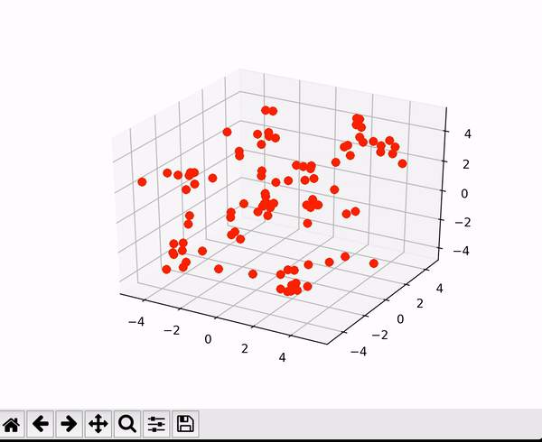

A bird flocking simulator written in Tensorflow.

The bird objectives are computed with respect to their velocities, which are
cast as trainable variables in tensorflow. Each gradient update step in Tensorflow
updates the bird velocities, and the new velocities are used to update the birds'
positions.